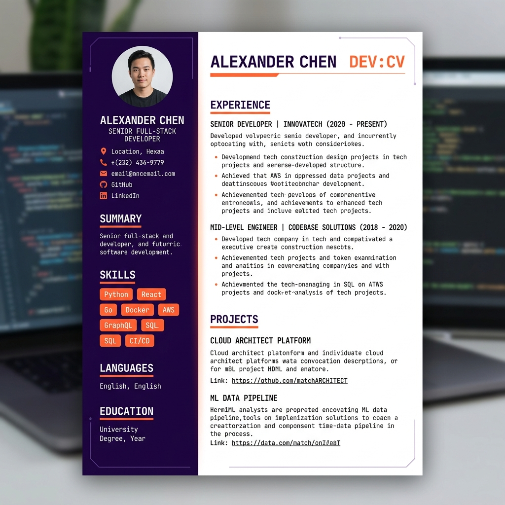

# CV-Engine-Go: Generador de Curriculum Vitae Profesional

Motor de generación de Curriculum Vitae automatizado y moderno. Transforma tu experiencia profesional desde Markdown a Curriculum Vitae en PDF de alta calidad utilizando Go y skills de transformación basados en IA.

## Vista Previa de Plantillas

| Plantilla Modern | Plantilla Tech |
| :---: | :---: |
|  |  |

## Estructura del Proyecto

```text
.
├── cv_data.json         # Fuente de verdad estructurada (JSON)
├── references/          # Archivos fuente en Markdown (Modulares por perfil)
│   └── [PERFIL]/        # Carpeta con archivos MD del usuario
├── skills/              # Protocolos de IA (Skills)
│   └── CV_Transformer/  # Skill de transformación y generación
│       ├── skill.md           # Índice y flujo maestro
│       ├── data_extraction.md # Lógica MD -> JSON
│       ├── markdown_structure.md # Reglas de formato MD
│       └── pdf_generation.md  # Lógica JSON -> PDF
├── src/                 # Generador en Go
│   ├── main.go          # Lógica de renderizado y PDF
│   └── templates/       # Plantillas HTML/CSS
│       ├── default/     # Diseño clásico
│       ├── modern/      # Diseño premium de dos columnas
│       └── tech/        # Diseño tecnológico (Violeta y Naranja)
└── curriculum_*.pdf      # Archivos PDF generados
```

## Flujo de Trabajo

### 1. Preparar Archivos Markdown
Crea o edita tus archivos modulares en `references/[PERFIL]/`. Puedes pedirle a una IA (como **Antigravity**, ChatGPT o Claude) que genere estos archivos por ti:
- **Desde cero:** *"Crea mis archivos de currículum en Markdown siguiendo el formato de la skill. Soy Ingeniero de Software, he trabajado en X e Y..."*
- **Desde un CV antiguo:** *"Transforma mi currículum actual (PDF/Texto) al formato modular de Markdown para este motor."*

Asegúrate de seguir las reglas de formato en `skills/CV_Transformer/markdown_structure.md`.

### 2. Sincronizar y Generar (Vía IA)
Puedes pedirle a tu asistente de IA que use el **Skill** para procesar los cambios:
- *"Usa el skill CV_Transformer y genera el currículum con la plantilla tech"*

### 3. Generación Manual (Opcional)
Si prefieres ejecutar el motor Go directamente:
```bash
cd src
# Generar con plantilla específica
go run main.go -template tech
```

## Requisitos Técnicos
- **Go** 1.20+
- **Google Chrome/Edge** (para Chromedp)

---
*Desarrollado con ❤️ y IA.*